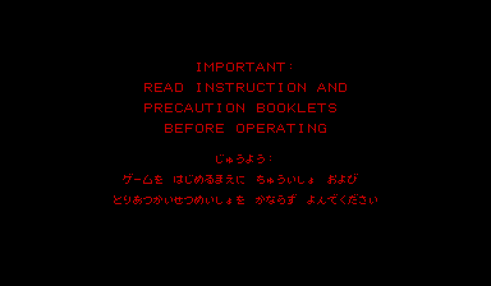

# MarioTennisVirtualBoyRecomp

Static V810→C recompilation of **Mario's Tennis** (Virtual Boy, 1995) running as a native Windows binary.
Built with the [vbrecomp](https://github.com/mstan/vbrecomp) framework.

Includes a shared launcher, persistent controls/settings, a ROM-preserving
mod catalog, and an optional full-color renderer using the original artwork. See [Mods and color](docs/MODS-AND-COLOR.md)
for installation, palette authoring, validation, and the experiment's limitations.

> **Status: Playable.** A full match against the CPU completes without crashes. Audio, video, and input are all wired. Pixel-perfect on the title/warning screen versus the Beetle VB reference (0 / 86 016 pixels differ at zero tolerance).

<p align="center"></p>

---

## For players

### Quick start

The **v0.2.2 Windows release** includes the Virtual Boy launcher, box art, and
the optional full-color mod. Color is disabled by default; the original ROM is
never modified. Linux/macOS build scripts are available for source builds.

1. Download `MarioTennisVirtualBoyRecomp-windows-x64.zip` from [Releases](../../releases).
2. Extract the entire ZIP, including `assets`, `licenses`, and `SDL2.dll`.
3. Provide your own Mario's Tennis cart dump (the binary will not run against any other file — it CRC32-verifies the ROM at launch). Required:
   - **CRC32:** `0x7CE7460D`
   - **SHA-256:** `5dc5e6b5d5f538f56b3b9727db1c7931d9dfe1bbd0743f698897e0fd90e70101`
   - **Size:** 524 288 bytes
4. Run it:
   ```
   MarioTennisVirtualBoyRecomp.exe --rom path\to\marios_tennis.vb
   ```

To enable color, import the included `marios-tennis-full-color-0.2.2.vbmod` in
**Mods**, then enable **Full-color renderer**. You can also install and enable
it explicitly from the command line:

```powershell
.\MarioTennisVirtualBoyRecomp.exe --install-mod .\marios-tennis-full-color-0.2.2.vbmod --enable-mod marios-tennis.full-color:full-color
```

The release executable omits the TCP debugger and private pose recorder.

### Controls

Keyboard:

| Virtual Boy   | Keyboard       |
|---------------|----------------|
| Left D-pad    | Arrow keys     |
| Right D-pad   | W / A / S / D  |
| A / B         | X / Z          |
| L / R         | Q / E          |
| Start / Select| Enter / Right Shift |
| Turbo         | TAB (skip 50.27 Hz pacing) |
| Settings menu | Esc (UI builds); close the window to quit |

Xbox controller (XInput, player 1):

| Virtual Boy   | Xbox             |
|---------------|------------------|
| Left D-pad    | D-pad (rebindable in launcher) |
| Right D-pad   | Right stick      |
| A / B         | A / B            |
| L / R         | LB / RB          |
| Start / Select| Start / Back     |

### Command-line flags

| Flag                  | Effect                                                  |
|-----------------------|---------------------------------------------------------|
| `--rom PATH`          | Cart file (required for play)                           |
| `--stereo`            | Show both eyes stacked vertically instead of single-eye |
| `--headless`          | No SDL window, TCP debug server only                    |
| `--port N`            | TCP debug port (default 4390)                           |
| `--help`              | Print full usage                                        |

The window opens at 768 × 448 (single-eye, 2× scale) by default. Resize freely — content letterboxes to preserve aspect.

---

## For developers

### ROM details

| Field   | Value |
|---------|-------|
| Title   | Mario's Tennis (Virtual Boy) |
| CRC32   | `0x7CE7460D` |
| SHA-256 | `5dc5e6b5d5f538f56b3b9727db1c7931d9dfe1bbd0743f698897e0fd90e70101` |
| Size    | 524 288 bytes |

The recompiler bakes this CRC32 into the generated dispatch file via `vb_game_expected_crc32()`. The runtime verifies at startup and refuses to launch on mismatch.

### Repo layout

```
MarioTennisVirtualBoyRecomp/
├── CMakeLists.txt             — top-level; forces VBRECOMP_GAME=marios_tennis
├── README.md                  — this file
├── LICENSE.md                 — repo licence
├── vbrecomp.pin               — pinned vbrecomp framework SHA
├── marios_tennis.toml         — per-cart codegen config (currently empty)
├── baseline-title-screen.png  — known-good render (1× regression baseline)
├── baseline-title-screen-3x.png — 1152 × 672 preview
├── generated/                 — recompiler output (committed; no ROM bytes)
├── roms/                      — your cart dump goes here (gitignored)
├── beetle-vb/                 — optional Beetle VB oracle clone (gitignored)
├── build/                     — CMake build dir (gitignored)
├── build-release/             — Release build dir (gitignored)
└── vbrecomp/                  — framework (separate repo: mstan/vbrecomp)
```

### Build from source

Prerequisites: Windows 10+, MSYS2 MinGW64 GCC, Ninja, CMake and SDL2, plus
Python 3.10+ (`tomli` is needed only on Python 3.10). Initialize both pinned
submodules with `git submodule update --init --recursive`.

```powershell
$env:PATH = "C:\msys64\mingw64\bin;$env:PATH"
& 'C:/msys64/mingw64/bin/cmake.exe' -S . -B build -G Ninja `
    -DCMAKE_BUILD_TYPE=Release `
    -DCMAKE_MAKE_PROGRAM=C:/msys64/mingw64/bin/ninja.exe `
    -DCMAKE_C_COMPILER=C:/msys64/mingw64/bin/gcc.exe `
    -DCMAKE_CXX_COMPILER=C:/msys64/mingw64/bin/g++.exe
& 'C:/msys64/mingw64/bin/cmake.exe' --build build --target vb-runtime mario-tennis-mods
.\build\vbrecomp\runtime\MarioTennisVirtualBoyRecomp.exe --rom roms\marios_tennis.vb
```

For separate development worktrees, pass `-DVBRECOMP_ROOT=/path/to/vbrecomp`
and `-DRECOMP_UI_ROOT=/path/to/recomp-ui` at configure time. No directory junctions
or submodule deletion are needed. `-DMARIO_TENNIS_UI=OFF` omits the launcher/menu;
package flags and the game renderer still work. `-DVBRECOMP_DEBUG_TOOLS=OFF`
removes TCP tooling for production. `--paused` requires debug tools.

Generated C is committed. To reproduce it, run from the framework checkout:

```powershell
python -m recompiler.cli.vbrecomp_codegen --rom /path/to/marios_tennis.vb --module marios_tennis --out /path/to/game/generated --seeds-toml /path/to/game/marios_tennis.toml
```

The submodule gitlinks are authoritative dependency pins; `vbrecomp.pin` mirrors
the framework SHA. The color package contains no game artwork or ROM bytes.

### Beetle VB oracle (development only)

To cross-check pixel output against [Beetle VB libretro](https://github.com/libretro/beetle-vb-libretro):

```powershell
# Build the static archive (one-time, see vbrecomp/docs/BRINGUP.md)
git clone https://github.com/libretro/beetle-vb-libretro.git beetle-vb
# ... follow BRINGUP.md to build mednafen_vb_libretro.dll

# Build the oracle target alongside vb-runtime
cmake --build build --target vb-beetle

# Run both processes, then diff
.\build\vbrecomp\runtime\vb-runtime.exe --rom roms\marios_tennis.vb --port 4390 --headless
.\build\vbrecomp\runtime\vb-beetle.exe  --rom roms\marios_tennis.vb --port 4391 --headless
python vbrecomp\tools\_framebuf_diff.py --tolerance 0
```

The shipped binary contains **none** of beetle-vb's code — the oracle is only built when the static archive is present, and the release zip never includes it.

### Cutting a release

```powershell
cmake --build build-release --target vb-runtime
mkdir release-stage
Copy-Item build-release\vbrecomp\runtime\vb-runtime.exe release-stage\MarioTennisVirtualBoyRecomp.exe
Copy-Item C:\msys64\mingw64\bin\SDL2.dll release-stage\
# author README.txt
Compress-Archive release-stage\* MarioTennisVirtualBoyRecomp-windows-x64.zip -Force

git tag -a vX.Y.Z -m "..."
git push origin vX.Y.Z
gh release create vX.Y.Z MarioTennisVirtualBoyRecomp-windows-x64.zip --title "..." --notes "..."
```

### Architecture

This is a **static recompiler**, not an emulator. The V810 machine code in the cart ROM is decoded once at codegen time and translated to C functions, one per cart function. Those C functions are compiled by gcc into native x86-64. At runtime there is no V810 fetch/decode/execute loop — each cart function is a native call.

- **Decoder + recompiler**: `vbrecomp/recompiler/` (Python).
- **Runtime**: `vbrecomp/runtime/` — V810 register state, MMIO bus, VIP (renderer), VSU (audio synthesis), interrupt controller, timer, input register, TCP debug server, SDL window + audio + XInput frontend.
- **Per-cart generated code**: `generated/marios_tennis_{full,dispatch}.c` — committed for build reproducibility (code only; no ROM bytes).

### Licence

The recompiler, runtime, and tooling are MIT (see [`vbrecomp/LICENSE`](https://github.com/mstan/vbrecomp/blob/master/LICENSE) and [`LICENSE.md`](LICENSE.md)).

Mario's Tennis is © 1995 Nintendo. This project does not include or distribute any copyrighted ROM content. Provide your own cart dump.

---

<p align="center">
  <sub><b>R.A.I.D. — Retro AI Development</b> · a Discord for AI-assisted retro reverse-engineering, decomp &amp; recomp</sub>
</p>

<p align="center">
  <a href="https://discord.gg/Ad9BwSzctP"></a>
</p>
