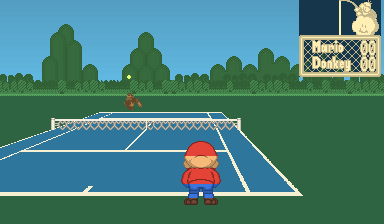
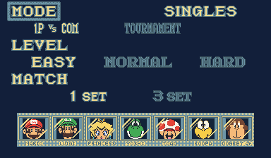

# Mods, shared UI, and the full-color renderer

The game now uses recomp-ui for ROM selection, video/audio settings, both native
D-pads, keyboard/controller bindings, and a versioned mod catalog. Press Escape
in-game (or the controller Guide button) to pause and open settings. The Mods
section can switch installed features live. Full package installation, version
selection, and option editing live in the preboot launcher.

Settings are saved beside the executable in `vbrecomp.cfg`; packages and feature
selections are under `mods/`. Use `--config` and `--mods-dir` for isolated profiles.
`--no-launcher` starts with saved settings; `--launcher` always opens the launcher.
The original 524,288-byte ROM is verified by exact SHA-256 before mod activation.
No ROM, generated code, or guest-memory patch is installed by the color package.

## Build and try it

Build the executable and the optional package:

```powershell
cmake --build build --target vb-runtime mario-tennis-mods
.\build\vbrecomp\runtime\MarioTennisVirtualBoyRecomp.exe --rom roms\marios_tennis.vb
```

In **Mods**, install
`build/mod-packages/marios-tennis-full-color-0.2.2.vbmod`, enable **Full-color
renderer**, and Play. It defaults off when first installed. To do the
same from the command line:

```powershell
.\build\vbrecomp\runtime\MarioTennisVirtualBoyRecomp.exe --rom roms\marios_tennis.vb --install-mod build\mod-packages\marios-tennis-full-color-0.2.2.vbmod --enable-mod marios-tennis.full-color:full-color
```

Use `--install-mod` only once per version. Later runs retain the selection.
Disable it through the menu or `--disable-mod marios-tennis.full-color:full-color`
to restore the original presentation. **Solid sky and court** controls background
fills; **Color saturation** ranges from grayscale to full saturation.

## What the renderer does



`src/tennis_color.cpp` uses source texels captured by the native rasterizer, along
with the game's four player-slot identities. Character materials are keyed by
original CHR content fingerprint and source atlas position, with unflipped
pixel masks. Moving world numbers, stereo parallax, and affine scaling do not
change a material's identity. The previous world guesses and screen-height body
bands are gone; Mario's hair no longer becomes a beige strip during animation.

The package includes material labels for all seven characters and their selection
portraits. Caps, hair, skin, garments, gloves, shoes, rackets, Yoshi's spines,
Toad's spots and Koopa's shell can use different colors. The masks preserve the
original pixel shapes and native occlusion. Original ROM/CHR pixels are not
included in the package; the supplied ROM remains the source of the artwork.



An uncatalogued tile retains native ink and its character's base color rather
than adopting another layer's palette. This is still a visual reconstruction:
finite animation captures do not prove every match, doubles setup or pose is
covered. Court fills infer projected edges, and title/HUD decoration still uses
a general UI palette. Native detail remains 384 by 224 per eye.

## Make a data-only palette mod

Copy `mods/full-color`, give it a new package ID/version in `manifest.toml`, and
edit the named hexadecimal RGB values in `palette.txt`. Keep the game target and
trusted plugin ID. Package it using:

```powershell
python vbrecomp/tools/pack_mod.py path/to/my-palette my-palette.vbmod
```

The ZIP contains metadata, palette values and material annotations. It cannot load a DLL or script.
Two enabled packages claiming `video.renderer` produce a conflict before launch;
disable one to use the other. A genuinely new rendering implementation is linked
into the game and registered under its own trusted ID. Other framework consumers
can use the same API without putting game-specific rules into VIP emulation.

The framework package runtime is adapted from snesrecomp, retaining its PolyForm
Noncommercial license. The game-owned color code and palette remain under this
repository's MIT license. See `vbrecomp/docs/MODS.md` for package authoring and the
framework's retained third-party notices.

Additional palette keys use `material.NAME`, where NAME is `background`, `ink`,
`cap`, `skin`, `trousers`, `brown`, `white`, `yellow`, `green`, `pink`, `hair`,
`mouth`, `cyan`, `dark_hair`, `navy`, `pupil`, `racket`, `gold`, `shell`, or `shirt`.
These override that material's RGB independently of the original palette aliases.

## Capture and author materials

The development game already provides a loopback TCP screenshot server. Launch
with `--paused --port 4495` and send newline-delimited JSON. `screenshot` takes
`path`, `eye` and `presented: 1`; omit `presented` for original pixels.
`source_dump` captures the displayed source coordinates, raw texels and hashes.
See `vbrecomp/docs/MODS.md` for the wire format and deterministic stepping.

The authoring tools require Python 3.11+ and Pillow. A reproducible capture route
selects each character using native controller input, then moves, serves and
swings while collecting displayed artwork. Use a private output directory:

```powershell
python tools/color_capture.py build/vbrecomp/runtime/MarioTennisVirtualBoyRecomp.exe roms/marios_tennis.vb private-capture --samples 360
python tools/color_materials.py private-capture private-capture/portraits.json mods/full-color/materials.bin
```

`--opponent 0 --characters 1` captures Mario as the distant opponent. Merge such
a second corpus with `color_materials.py --extra-capture other-capture`. Inspect
the emitted color contact sheets, update the authoring rules/material annotations,
rebuild the package, and validate it in the actual runtime. Captures contain
decoded owner-ROM artwork and must not be committed or bundled.

`materials.bin` uses magic `VBMAT002`, a little-endian uint32 tile count, seven
32x32 portrait material masks, then 72-byte tile records. Each record is
`<BBBBI` (character 0..6, atlas size 128, tile x/y, CHR FNV-1a), followed by 64
unflipped material bytes. Bits 0..4 select the material; bits 5..6 select one of
four shades; bit 7 is reserved. The loader rejects invalid sizes, IDs, shades,
duplicate keys, truncation and trailing data before replacing an active catalog.

## Validation

Run the owner-ROM integration checks against a debug-tools build:

```powershell
python tools/validate_color.py build/vbrecomp/runtime/MarioTennisVirtualBoyRecomp.exe roms/marios_tennis.vb build/mod-packages/marios-tennis-full-color-0.2.2.vbmod build/color-check
python tools/validate_ui_windows.py build/vbrecomp/runtime/MarioTennisVirtualBoyRecomp.exe roms/marios_tennis.vb build/mod-packages/marios-tennis-full-color-0.2.2.vbmod build/ui-check
python tools/validate_materials.py build/vbrecomp/runtime/MarioTennisVirtualBoyRecomp.exe roms/marios_tennis.vb build/mod-packages/marios-tennis-full-color-0.2.2.vbmod mods/full-color/materials.bin build/material-check
```

The first follows a deterministic boot/service/rally route, compares both raw
eyes, CPU registers and all 64 KiB WRAM with color disabled/enabled, and checks a
data-only alternate palette. Presented images differ while the native outputs
and subsequent game state remain identical. It also verifies the ROM file hash.
The second drives only its own Windows process: rebinds A to C in the launcher,
verifies saved settings and actual input-register behavior, checks menu pause,
and toggles color off/on without advancing or changing the displayed game state.
Both leave their evidence in the requested output directory.

The material check replays each character's animation route, measures catalog
coverage in both eyes, verifies that screenshots do not advance the paused guest,
and saves actual PNG contact sheets and animated GIFs for visual inspection. It
fails below 99% coverage in any sampled frame. Use fresh output directories when
changing a package without changing its version; validators reject stale installs.
CTest includes ROM-free material-file rejection tests, native source/occlusion
tests, and the package lifecycle/security integration test.

The 0.2.0 pass was checked with 360 animation samples per character in both eyes:
all sampled character pixels had material coverage. A separate 360-sample match
checks Mario as the distant opponent. The catalog contains 12,713 tile material
records from 646 captured poses. These are finite route checks, not a claim of
exhaustive game coverage; use the same tools when extending the artwork catalog.

Also validated: 77 Python recompiler tests (5 oracle-dependent skips), unchanged
regenerated C, package lifecycle/security tests, shared-UI profile/assets/runtime
tests, and builds with UI off, debug tools off, and SDL absent. These checks do
not constitute a new full-game Beetle oracle comparison or physical-gamepad test.
Linux/macOS packaging scripts were updated for the executable name, launcher
assets, mod archive, notices, and writable profiles; their shell syntax was
checked on Windows, but native Linux/macOS builds were not run.


### 0.2.1 gameplay follow-up

A user capture exposed a new-round Mario pose with only 312 of 2,374 visible
character texels covered by the original catalog. Version 0.2.1 adds 184 Mario
and 37 Luigi tile records (12,934 total), including this pose and overhead
strokes. Previously reviewed nonzero character annotations are preserved.
`color_materials.py --base-catalog previous-materials.bin` supports this additive
workflow; new captures fill missing entries without voting over reviewed colors.

Lakitu now has a separate `hud-materials.bin` asset using the same validated
container. Its character-0 namespace identifies scoreboard artwork, independently
of the player catalog. Source positions and original tile fingerprints identify
both facing directions; yellow skin, green shell, glasses, fishing rod, cloud
and outlines are authored in original sprite coordinates. Run `color_hud.py
OUTPUT SOURCES...` on private TCP source dumps to extend this asset.

The validator accepts `--frame-step` to exercise a different input cadence and
`--hud-materials` to check the referee. It reports distinct source pixel images
and the longest unchanged run, and rejects long runs of repeated static images.
Missing referee frames are retained as private `hud-missing-*.src` captures.
Frame counts alone do not establish point, round, or full-match coverage.
The owner-reported reference pose also has permanent cap, skin, hair, shirt,
shorts, glove and shoe material landmarks in the ROM-free CTest.

The final 0.2.1 replay checks 240 samples at a 12-frame input cadence, in both
eyes, including the later overhead pose. Character and referee material coverage
are both 100% in this route. See `color-round-validation.json` for counts and
hashes, and `color-round.png` for an actual TCP screenshot. ROM, native images,
WRAM, CPU registers and subsequent play remain equal in the off/on comparison.


### 0.2.2: transitions, transparent HUD and Virtual Boy launcher

Removed the artificial dark rectangle behind Lakitu and the scoreboard; native
artwork and mesh now sit over the sky/scenery. Added 69 Mario and 181 Luigi
material tiles, including overhead recovery and distant-player poses. The
13,184-record player catalog preserves all previously reviewed nonzero texels
and portrait masks. The full-color feature remains opt-in and disabled by default.

The launcher now uses recomp-ui's dedicated black/crimson Virtual Boy palette,
with warm text and focus accents, plus the North American display-box front scan.
The source and copyright notice for the box art are in `assets/NOTICE.md` and are
staged with the launcher. The native framebuffer does not use the launcher palette.

Debug builds can record every newly encountered uncatalogued player pose by
setting `VB_TENNIS_CAPTURE_MISSING` to an absolute private output directory.
The recorder runs on presented frames, independently of TCP sampling intervals.
It uses draw-time source coordinates and verifies live CHR before recovering
hidden pixels. It writes at most 1,024 deduplicated pose files, disables itself
on output failure, and emits `capture-summary.json` on normal exit. This code
is absent from builds with `VBRECOMP_DEBUG_TOOLS=OFF`. Captures contain original
owner-ROM artwork: do not commit or package them. They are not auto-applied.

`tools/capture_live_windows.py EXE ROM PACKAGE OUTPUT --check` drives only its
own hidden SDL window with native input. Stereo mode checks both eyes on every
presented frame; --check rejects any unknown frame. Use `--character 1
--opponent 0` for Luigi against Mario and `--step 17` to vary input timing.
Import its `poses` directory with `color_materials.py --extra-capture OUTPUT
--base-catalog previous-materials.bin`, inspect the authored colors, then rebuild
and replay. The TCP collector also supports separate `--frame-step` and
`--input-step` values, so increasing capture density need not change the inputs.

Final verification covered 7,018 eye-frames per route (Mario/Luigi and
Luigi/Mario): 14,036 total, with zero unknown character frames. See
`color-recovery-validation.json` and `color-recovery.png`. These are finite
input routes; the private recorder supports further discoveries during play.
